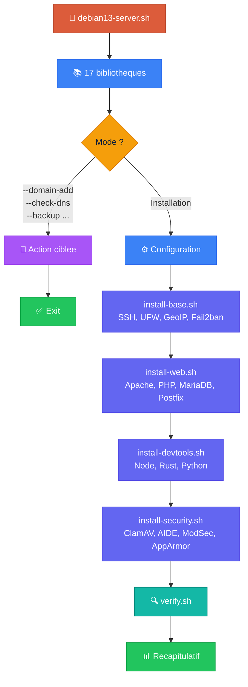
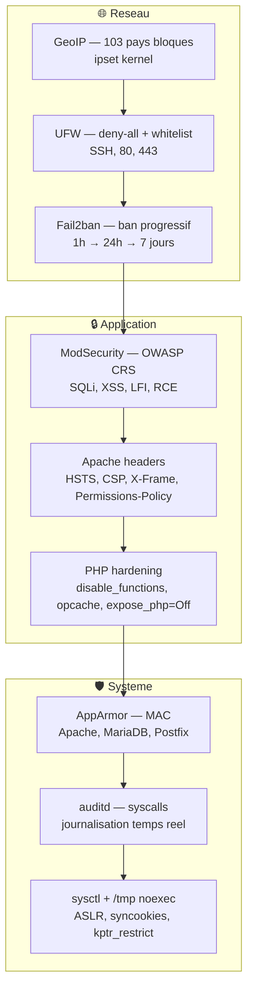
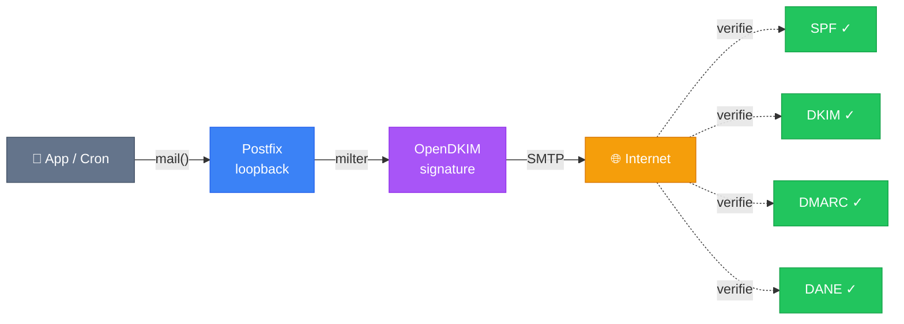

<div align="center">

<br>

<h1>🛡️ debian13-server</h1>

<h3>Bootstrap · Hardening · Multi-domaines</h3>

<p><em>Debian 13 (Trixie) — OVH</em></p>

<br>


<br>


&nbsp;&nbsp;


<br><br>

*Un script. Un serveur. De zero a production.*

<br>

```
sudo ./debian13-server.sh
```

<br>

</div>

---

## ⚡ Demarrage rapide

```bash
# Installation complete (interactif — guide la config)
sudo ./debian13-server.sh

# Mode silencieux (valeurs par defaut sures)
sudo ./debian13-server.sh --noninteractive

# Simulation sans modification
sudo ./debian13-server.sh --dry-run

# Audit seul (verification + rapport)
sudo ./debian13-server.sh --audit
```

> [!TIP]
> **Premiere installation ?** Le script guide la configuration : hostname, SSH, email, OVH.
> Les executions suivantes reutilisent `debian13-server.conf` automatiquement.

---

## 🔩 Stack complete

<table>
<tr>
<td width="50%" valign="top">

### 🔒 Securite reseau

| | Detail |
|:--|--------|
| **SSH** | Cle uniquement, port custom, `sntrup761` post-quantique |
| **UFW** | Deny-all in/out, whitelist stricte |
| **Fail2ban** | 3 niveaux : standard → custom → recidive (1h → 24h → 7j) |
| **GeoIP** | ipset kernel — 103 pays bloques |

</td>
<td width="50%" valign="top">

### 🌐 Stack web

| | Detail |
|:--|--------|
| **Apache** | PHP-FPM, mod_security OWASP CRS, headers defensifs |
| **MariaDB** | Hardening auto, phpMyAdmin URL aleatoire |
| **SSL** | Certbot wildcard DNS-01 (OVH) ou HTTP-01 |
| **DNS** | SPF, DKIM, DMARC, CAA, TLSA — upsert auto HMAC |

</td>
</tr>
<tr>
<td width="50%" valign="top">

### 🛡️ Defense systeme

| | Detail |
|:--|--------|
| **ModSecurity** | WAF OWASP CRS (SQLi, XSS, LFI, RCE) |
| **AppArmor** | Confinement MAC (Apache, MariaDB, Postfix) |
| **auditd** | Journalisation syscalls sensibles |
| **sysctl** | ASLR, syncookies, kptr_restrict, `/tmp noexec` |

</td>
<td width="50%" valign="top">

### 📧 Email & observabilite

| | Detail |
|:--|--------|
| **Postfix** | Send-only loopback, OpenDKIM multi-domaines |
| **DANE/TLSA** | Certificat TLS publie dans le DNS |
| **Dashboard** | Temps reel HTML/CGI, URL secrete + IP |
| **Alertes** | Slack · Telegram · Discord |

</td>
</tr>
</table>

---

## 🌍 Multi-domaines

Chaque domaine ajoute obtient **automatiquement** l'integralite de la stack :

```bash
sudo ./debian13-server.sh --domain-add example.com
```

<br>


<br>

| Etape | Fonction | Resultat |
|:-----:|----------|----------|
| **1** | `dm_register_domain` | `domains.conf` — domaine:selecteur |
| **2** | `dm_generate_dkim_key` | `/etc/opendkim/keys/{domain}/{sel}.private` |
| **3** | `dm_rebuild_opendkim` | keytable + signingtable + trustedhosts |
| **4** | `dm_deploy_parking` | Page WebGL Three.js 3D + `robots.txt` |
| **5** | `dm_setup_dns` | API OVH : A, AAAA, www, SPF, DKIM, DMARC, CAA |
| **6** | `dm_obtain_ssl` | Certbot DNS-01 wildcard ou HTTP-01 |
| **7** | `dm_deploy_vhosts` | 000-redirect + 010-https + 020-wildcard |
| **8** | `dm_deploy_logrotate` | `/etc/logrotate.d/apache-vhost-{domain}` |

> [!NOTE]
> Chaque etape est **tolerante aux erreurs**. Si le DNS echoue (pas de credentials OVH), le VHost est quand meme deploye. Corriger ensuite avec `--check-dns --fix`.

<details>
<summary><strong>📦 Operations avancees sur les domaines</strong></summary>

<br>

| Operation | Commande | Description |
|-----------|----------|-------------|
| **Staging** | `--domain-staging example.com` | Deploiement sans SSL/DNS |
| **Promotion** | `--domain-promote example.com` | Staging → production |
| **Groupes** | `--domain-group example.com prod` | Organisation logique |
| **Export** | `--domain-export example.com` | Archive `tar.gz` autonome |
| **Import** | `--domain-import example.tar.gz` | Restauration / migration |
| **DKIM** | `--dkim-rotate example.com` | Selecteur horodate, ancien conserve 48h |
| **Proxy** | `dm_deploy_proxy` | VHost reverse proxy + WebSocket |
| **Git deploy** | `dm_setup_git_deploy` | Push-to-deploy via hook `post-receive` |
| **Container** | `dm_deploy_container` | Docker/Podman + reverse proxy auto |
| **WAF** | `deploy_waf_domain_rules` | ModSecurity par domaine + rate-limiting |
| **mTLS** | `mtls_*` | CA interne + certificats clients |

```bash
# Staging → production
sudo ./debian13-server.sh --domain-staging example.com
sudo ./debian13-server.sh --domain-promote example.com

# Migration inter-serveurs
sudo ./debian13-server.sh --domain-export example.com
sudo ./debian13-server.sh --domain-import example.com.tar.gz
```

</details>

---

## 🏗️ Architecture

### Flux d'execution



### Defense en profondeur



> [!IMPORTANT]
> **9 couches de securite** entre Internet et vos donnees — du filtrage GeoIP au niveau kernel jusqu'au hardening sysctl.

### Stack email



---

## 🧰 Operations systeme

<table>
<tr>
<td width="50%" valign="top">

#### DNS & Certificats

```bash
sudo ./debian13-server.sh --check-dns
sudo ./debian13-server.sh --check-dns --fix
```

#### Backup & Restore

```bash
sudo ./debian13-server.sh --backup
sudo ./debian13-server.sh --backup-list
sudo ./debian13-server.sh --snapshot-list
sudo ./debian13-server.sh --rollback <id>
```

</td>
<td width="50%" valign="top">

#### Clonage & Fleet

```bash
sudo ./debian13-server.sh --clone 10.0.0.2

sudo ./debian13-server.sh --fleet-add web1 10.0.0.2
sudo ./debian13-server.sh --fleet-status
sudo ./debian13-server.sh --fleet-exec "apt update"
sudo ./debian13-server.sh --fleet-sync
```

#### Observabilite

```bash
sudo ./debian13-server.sh --dashboard example.com
sudo ./debian13-server.sh --audit
sudo ./debian13-server.sh --audit-html /tmp/rapport.html
```

</td>
</tr>
</table>

---

## ✅ Tests


```bash
make test           # 465 tests bats-core
make lint           # shellcheck
make check-syntax   # bash -n sur tout
make docker-test    # tests isoles dans Docker
```

<details>
<summary><strong>📊 Repartition des tests</strong></summary>

<br>

| Domaine | Tests | Domaine | Tests |
|---------|:-----:|---------|:-----:|
| Registre domaines | ~40 | Operations | ~60 |
| Deploiement | ~35 | Fonctionnalites | ~50 |
| Securite | ~45 | Avance | ~55 |
| Infrastructure | ~55 | Observabilite | ~30 |
| | | Conventions | ~25 |

</details>

<details>
<summary><strong>📝 Ecrire un test</strong></summary>

<br>

```bash
#!/usr/bin/env bats

load test_helper

setup() {
  setup_test_env       # Cree $TEST_DIR avec sous-repertoires temp
  override_paths       # Redirige DOMAINS_CONF, DKIM_KEYDIR, etc.
  source "${BATS_TEST_DIRNAME}/../lib/domain-manager.sh"
}

teardown() { teardown_test_env; }

@test "get_selector: retourne le selecteur enregistre" {
  dm_register_domain "test.com" "mail"
  run dm_get_selector "test.com"
  [ "$output" = "mail" ]
}
```

> `setup_test_env` cree un repertoire temporaire. `override_paths` redirige toutes les constantes vers ce repertoire. **Zero effet de bord** sur le systeme reel.

</details>

---

## ⚙️ Configuration

Le script genere `debian13-server.conf` a la premiere execution.

| Variable | Defaut | Description |
|----------|:------:|-------------|
| `HOSTNAME_FQDN` | *interactif* | FQDN du serveur |
| `SSH_PORT` | `65222` | Port SSH |
| `ADMIN_USER` | `debian` | Utilisateur sudo |
| `DKIM_SELECTOR` | `mail` | Selecteur DKIM principal |
| `EMAIL_FOR_CERTBOT` | *interactif* | Email Let's Encrypt + alertes |
| `CERTBOT_WILDCARD` | `true` | Wildcard via DNS-01 OVH |
| `MODSEC_ENFORCE` | `true` | ModSecurity en blocage |
| `TRUSTED_IPS` | *vide* | IPs whitelist (ModSec, F2B, debug) |
| `SLACK_WEBHOOK` | *vide* | Webhook Slack |
| `TELEGRAM_BOT_TOKEN` | *vide* | Token bot Telegram |
| `DISCORD_WEBHOOK` | *vide* | Webhook Discord |

---

## 📋 Prerequis

> [!IMPORTANT]
> **Debian 13** (Trixie) — installation vierge, acces root, connexion internet.

Les credentials API OVH sont optionnels — necessaires uniquement pour le DNS automatique et les certificats wildcard.

<details>
<summary><strong>🔑 Creer les credentials API OVH</strong></summary>

<br>

1. Aller sur **[eu.api.ovh.com/createToken/](https://eu.api.ovh.com/createToken/)**
2. Configurer les droits :

```
GET    /domain/zone/*
POST   /domain/zone/*
DELETE /domain/zone/*
GET    /ip/*
POST   /ip/*
DELETE /ip/*
```

3. Sauvegarder les 3 cles (Application Key, Application Secret, Consumer Key)
4. Le script les demandera a la premiere execution, ou les configurer dans `/root/.ovh-dns.ini` (mode `600`)

</details>

---

## 📂 Arborescence

```
debian13-server.sh              ← Point d'entree unique
│
├── lib/
│   ├── core.sh                 Couleurs, logging
│   ├── constants.sh            Constantes readonly
│   ├── helpers.sh              Utilitaires, securite, monitoring
│   ├── config.sh               Gestion .conf
│   ├── ovh-api.sh              API OVH (HMAC-SHA1)
│   ├── domain-manager.sh       Multi-domaines (47 fonctions)
│   ├── install-base.sh         SSH, UFW, GeoIP, Fail2ban
│   ├── install-web.sh          Apache, PHP, MariaDB, Postfix, Certbot
│   ├── install-devtools.sh     Node.js, Rust, Python, Composer
│   ├── install-security.sh     ClamAV, AIDE, ModSec, AppArmor, sysctl
│   ├── verify.sh               19 verifications (emit_check)
│   ├── audit-html.sh           Rapport HTML + email
│   ├── backup.sh               Backup (configs, DKIM, DB, crontab)
│   ├── clone.sh                Clonage serveur (SSH + rsync)
│   ├── fleet.sh                Multi-serveurs
│   ├── tui.sh                  TUI whiptail/dialog + fallback
│   └── hooks.sh                Plugins (hooks.d/)
│
├── templates/                  VHosts, parking WebGL, erreurs, cron
├── tests/                      43 fichiers — 465 tests bats
├── hooks.d/                    Scripts hook
├── domains.conf                Registre domaines
├── Makefile                    test, lint, check-syntax, docker-test
└── Dockerfile.test             Environnement test isole
```

---

## 📐 Conventions

| | Convention | Detail |
|:-:|:-----------|--------|
| 📛 | **Nommage** | `dm_*` domaines · `ovh_*` API · `verify_*` checks · `backup_*` sauvegardes |
| 💉 | **Injection** | `: "${VAR:=default}"` — chemins overridables en test |
| ♻️ | **Idempotence** | Verification d'etat avant chaque action |
| 🪝 | **Hooks** | `pre-*` / `post-*` sur operations destructives |
| 📋 | **Logging** | `log` info · `warn` warning · `err` erreur · `die` fatal |
| 📸 | **Snapshots** | Auto-snapshot avant domain-add/remove/rollback |
| 📄 | **Templates** | Placeholders `__VAR__` → `sed` au deploiement |

---

<div align="center">

<br>

<sub>Usage prive — Auteur : Seb</sub>

<br>

</div>
